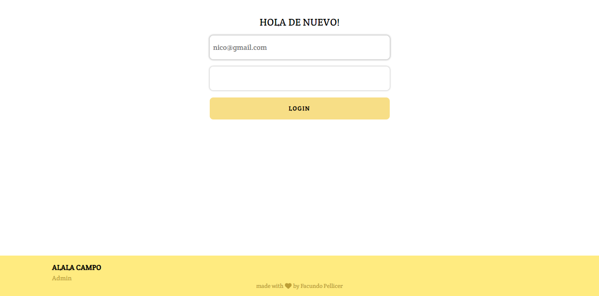

### Web informativa sobre una finca con 3 casas en alquiler.

La idea era mostrar el lugar y facilitar una forma de contacto.

Cada casa cuenta con su propio calendario donde se pueden ver las fechas disponibles y reservadas.

El administrador de la página posee una cuenta con la cual pueden entrar, configurar las reservas para cada casa y ver información sobre ellas.

## Clientes

## Admin

